```mermaid
graph LR
    A[👨â€ğŸ’» 개발ì<br/>코드 수정] --> B[📤 Git Push]
    B --> C[ğŸ—ï¸ ë¹Œë“œ 서버<br/>Git pull + Build]
    C --> D[🚀 실행 서버<br/>Deploy + Restart]
    D --> E[🌠사용ì<br/>웹 서비스 ì ‘ì†]
    
    style A fill:#e1f5fe
    style B fill:#fff3e0
    style C fill:#f3e5f5
    style D fill:#e8f5e8
    style E fill:#fce4ec
```

# 🚀 서버 배포 가이드 (Server-to-Server Deployment)

## 📋 목차
0. [실제 배포 Flow](#0-실제-배포-flow)
1. [빌드 서버 설정 및 운영](#1-빌드-서버-설정-및-운영)
2. [실행 서버 설정 및 운영](#2-실행-서버-설정-및-운영)
3. [배포 스크립트 상세 가이드](#3-배포-스크립트-상세-가이드)
4. [문제 해결 및 모니터링](#4-문제-해결-및-모니터링)

## 🔄 0. 실제 배포 Flow

### 전체 Flow (첫 설치부터 배포까지)


### 업데이트 배포 Flow (설정 완료 후)


### 상세 배포 과정

```mermaid
sequenceDiagram
    participant Dev as 👨‍💻 개발자
    participant Git as 📚 Git 저장소
    participant Build as 🏗️ 빌드 서버
    participant Deploy as 🚀 실행 서버
    participant User as 🌐 사용자
    
    Dev->>Git: 1. 코드 수정 및 Push
    Git->>Build: 2. Git pull (최신 코드)
    Build->>Build: 3. npm install (의존성 업데이트)
    Build->>Build: 4. npm run build (빌드)
    Build->>Deploy: 5. rsync (파일 전송)
    Deploy->>Deploy: 6. npm install --omit=dev (최초 또는 package.json 변경 시)
    Deploy->>Deploy: 7. PM2 restart
    Deploy->>Deploy: 8. Nginx reload
    User->>Deploy: 9. 웹 서비스 접속
```


### 서버 간 배포 아키텍처


## 🏗️ 1. 빌드 서버 설정 및 운영

### 1.1 초기 설정 (First Time Setup)

#### 1.1.1 서버 준비

**기본 패키지 설치:**
```bash
# Ubuntu 20.04+ 기준
sudo apt update && sudo apt upgrade -y
sudo apt install -y git curl unzip jq build-essential
```

**Node.js 22.x 설치 (아래 중 하나 선택):**

**방법 1: nvm 사용 (권장 - 버전 관리 용이)**
```bash
# nvm 설치
curl -o- https://raw.githubusercontent.com/nvm-sh/nvm/v0.39.7/install.sh | bash
source ~/.bashrc  # 또는 source ~/.zshrc

# Node.js 22 설치 및 기본 버전 설정
nvm install 22
nvm use 22
nvm alias default 22
```
- **장점**: 여러 Node.js 버전 관리 가능, 사용자별 설치 (sudo 불필요)
- **단점**: 쉘 재시작 필요, PM2 PATH 설정 주의 필요

**방법 2: snap 사용 (가장 간단)**
```bash
sudo snap install node --classic --channel=22
```
- **장점**: 한 줄로 설치 완료, 자동 업데이트
- **단점**: Ubuntu/일부 배포판만 지원

**방법 3: NodeSource 사용 (전통적 방식, 안정적)**
```bash
curl -fsSL https://deb.nodesource.com/setup_22.x | sudo -E bash -
sudo apt-get install -y nodejs
```
- **장점**: 시스템 전역 설치, 가장 안정적, 모든 사용자가 사용
- **단점**: 버전 변경 시 재설치 필요

**설치 확인:**
```bash
node -v   # v22.x.x 출력 확인
npm -v    # 10.x 이상 확인
which node
```

**문제 해결:**
```bash
# nvm 명령을 찾을 수 없을 때
source ~/.nvm/nvm.sh

# snap 설치 실패 시
sudo apt install snapd
sudo systemctl start snapd

# NodeSource 설치 충돌 시
sudo apt remove -y nodejs npm
sudo apt purge -y nodejs npm
sudo apt autoremove -y
# 그 다음 재설치
```

**SSH 키 설정 (Git 저장소 접근용):**
```bash
# Private 저장소인 경우에만 필요
ssh-keygen -t rsa -b 4096 -C "build-server@your-domain.com"
# Public 저장소인 경우 생략 가능
```

#### 1.1.2 프로젝트 설정
```bash
# 1. 기본 디렉토리 생성
sudo mkdir -p /home/iitp-adm/iitp-dabt-admin/source
sudo mkdir -p /home/iitp-adm/iitp-dabt-admin/deploy
sudo chown $USER:$USER /home/iitp-adm/iitp-dabt-admin

# 2. Git에서 소스 다운로드
cd /home/iitp-adm/iitp-dabt-admin/source
git clone https://github.com/your-repo/iitp-dabt-admin.git .

# 3. 환경 변수 설정 (npm install 전에 설정 필요)
cp env.sample.build-server .env
# .env 파일 편집 (빌드 서버용 설정)

# 4. 의존성 설치 (NPM_CONFIG_PRODUCTION=true가 적용됨)
npm install
```

#### 1.1.3 빌드 서버 환경 변수 설정
```bash
# .env 파일 생성 (빌드 서버용)
cp env.sample.build-server .env

# 또는 직접 생성
cat > .env << 'EOF'
# Git 설정
GIT_REPO_URL=https://github.com/your-repo/iitp-dabt-admin.git
GIT_BRANCH=main

# 경로 설정
SOURCE_PATH=/home/iitp-adm/iitp-dabt-admin/source
DEPLOY_PATH=/home/iitp-adm/iitp-dabt-admin/deploy

# 빌드 설정
NODE_ENV=production
NPM_CONFIG_PRODUCTION=true
EOF
```

### 1.2 일상 운영 (Daily Operations)

#### 1.2.1 전체 빌드 및 배포
```bash
# 빌드 서버에서 실행
cd /home/iitp-adm/iitp-dabt-admin/source
npm run build:server
```

#### 1.2.2 개별 빌드 및 배포
```bash
# Backend만 빌드 및 배포
npm run build:server:be

# Frontend만 빌드 및 배포
npm run build:server:fe

# Common 패키지만 빌드 및 배포
npm run build:server:common
```

> 중요(Frontend 빌드 환경변수): Vite의 `VITE_*` 변수는 "빌드 시점"에만 주입됩니다. 실행 서버의 `fe/.env`는 프로덕션(dist) 런타임에 영향을 주지 않습니다.
>
> **시나리오 A: 독립 도메인/루트 경로 배포 (기본)**
> - 예: `https://admin.example.com` 또는 `http://192.168.1.100`
> - 환경변수 설정 불필요 (기본값 `/` 사용)
>
> **시나리오 B: 서브패스 배포 (한 서버에 여러 서비스 공존 시)**
> - 예: `https://example.com/adm` (관리자), `https://example.com/docs` (문서)
> - 빌드 전 환경변수 설정 필수:
> ```bash
> export VITE_BASE=/adm/
> export VITE_API_BASE_URL=/adm/api
> npm run build:server:fe
> ```

### 1.3 빌드 스크립트 상세

#### 1.3.1 build-server.js 동작 과정 (업데이트됨)


- ensureBuilt: dist 디렉터리가 없거나 비어 있으면 해당 패키지에서 `npm ci` 후 `npm run build:clean`을 수행해 보강합니다.
- 안전 복사: 글롭(*)을 사용하지 않고 `cp -a dist/. <deploy>`로 디렉터리 단위 복사합니다.

#### 1.3.2 빌드 시 버전 정보 출력
빌드 시작 시 다음 정보가 자동으로 출력됩니다:
```bash
📋 빌드할 프로젝트 버전 정보:
   🏗️  Backend: 1.0.0
   🎨 Frontend: 1.0.0
   📦 Common: 1.0.0
   🏷️  Git 태그: v1.0.0
```

#### 1.3.3 빌드 서버 디렉토리 구조
```
/home/iitp-adm/iitp-dabt-admin/
├── source/                        # 소스 코드
│   ├── packages/common/
│   ├── be/
│   ├── fe/
│   ├── script/
│   └── package.json
└── deploy/                        # 배포 폴더
    ├── common/
    ├── backend/
    └── frontend/
```

## 🚀 2. 실행 서버 설정 및 운영

### 2.1 초기 설정 (First Time Setup)

#### 2.1.1 서버 준비

**기본 패키지 설치:**
```bash
# Ubuntu 20.04+ 기준
sudo apt update && sudo apt upgrade -y
sudo apt install -y git curl unzip jq build-essential nginx postgresql postgresql-contrib
```

**Node.js 22.x 설치 (아래 중 하나 선택):**

**방법 1: nvm 사용 (권장 - 버전 관리 용이)**
```bash
curl -o- https://raw.githubusercontent.com/nvm-sh/nvm/v0.39.7/install.sh | bash
source ~/.bashrc

nvm install 22
nvm use 22
nvm alias default 22
```
- **장점**: 여러 버전 관리, 사용자별 설치
- **단점**: PM2 PATH 설정 필요

**방법 2: snap 사용 (가장 간단)**
```bash
sudo snap install node --classic --channel=22
```
- **장점**: 한 줄 설치, 자동 업데이트
- **단점**: Ubuntu/일부 배포판만 지원

**방법 3: NodeSource 사용 (전통적, 안정적)**
```bash
curl -fsSL https://deb.nodesource.com/setup_22.x | sudo -E bash -
sudo apt-get install -y nodejs
```
- **장점**: 시스템 전역 설치, 안정적
- **단점**: 버전 변경 시 재설치

**설치 확인:**
```bash
node -v && npm -v && which node
```

**PM2 설치:**
```bash
sudo npm install -g pm2
pm2 -v
```

> **nvm 사용 시 주의**: PM2 startup 설정 시 PATH 명시 필요
> ```bash
> sudo env PATH=$PATH pm2 startup systemd -u <user> --hp /home/<user>
> ```

#### 2.1.2 실행 환경 설정
```bash
# 1. 기본 디렉토리 생성
sudo mkdir -p /var/www/iitp-dabt-admin/be
sudo mkdir -p /var/www/iitp-dabt-admin/fe
sudo mkdir -p /var/www/iitp-dabt-admin/script
sudo chown $USER:$USER /var/www/iitp-dabt-admin -R

# 2. PM2 설정 (설치/검증/자동기동)
# 2-1) 설치 검증
pm2 -v
command -v pm2

# 2-2) (선택) nvm 사용 시 PATH 포함 예시
# export PATH="$PATH:/home/<user>/.nvm/versions/node/v22.x.x/bin"
# pm2 -v

# 2-3) 부팅 자동 실행(systemd)
# 로그인 사용자와 홈 디렉터리를 지정하세요.
sudo env PATH=$PATH pm2 startup systemd -u <user> --hp /home/<user>
pm2 save

# 3. Nginx 설정

**시나리오 A: 독립 도메인/루트 경로 배포**
```bash
sudo tee /etc/nginx/sites-available/iitp-dabt << 'EOF'
upstream backend {
    server 127.0.0.1:30000;
}

server {
    listen 80;
    server_name admin.example.com;
    root /var/www/iitp-dabt-admin/fe/dist;
    index index.html;

    # SPA fallback
    location / {
        try_files $uri $uri/ /index.html;
    }
    
    # Backend API
    location /api/ {
        proxy_pass http://backend/api/;
        proxy_http_version 1.1;
        proxy_set_header Host $host;
        proxy_set_header X-Real-IP $remote_addr;
        proxy_set_header X-Forwarded-For $proxy_add_x_forwarded_for;
        proxy_set_header X-Forwarded-Proto $scheme;
    }
}
EOF
```

**시나리오 B: 서브패스 배포 (여러 서비스 공존)**
```bash
sudo tee /etc/nginx/sites-available/iitp-dabt << 'EOF'
upstream backend {
    server 127.0.0.1:30000;
}

server {
    listen 80;
    server_name example.com;

    # API 프록시
    location /adm/api/ {
        proxy_pass http://backend/api/;
        proxy_http_version 1.1;
        proxy_set_header Host $host;
        proxy_set_header X-Real-IP $remote_addr;
        proxy_set_header X-Forwarded-For $proxy_add_x_forwarded_for;
        proxy_set_header X-Forwarded-Proto $scheme;
    }

    location = /adm { return 301 /adm/; }

    location ^~ /adm/assets/ {
        alias /var/www/iitp-dabt-admin/fe/dist/assets/;
        try_files $uri =404;
    }

    # SPA fallback (alias 사용 시)
    location /adm/ {
        alias /var/www/iitp-dabt-admin/fe/dist/;
        index index.html;
        try_files $uri $uri/ /adm/index.html;
    }
}
EOF
```

# 4. Nginx 설정 활성화
sudo ln -s /etc/nginx/sites-available/iitp-dabt /etc/nginx/sites-enabled/

# 5. Nginx 설정 검증
sudo nginx -t

# 6. Nginx 재시작
sudo systemctl reload nginx
```

#### 2.1.3 실행 서버 환경 변수 설정
```bash
# .env 파일 생성 (실행 서버용)
sudo cp env.sample /var/www/iitp-dabt-admin/be/.env

# 또는 직접 생성
sudo tee /var/www/iitp-dabt-admin/be/.env << 'EOF'
# 데이터베이스 설정
DB_HOST=localhost
DB_PORT=5432
DB_NAME=iitp_dabt_admin
DB_USER=your_db_user
DB_PASSWORD=your_db_password

# JWT 설정
JWT_SECRET=your-production-jwt-secret
JWT_ISSUER=iitp-dabt-api
ACCESS_TOKEN_EXPIRES_IN=15m
REFRESH_TOKEN_EXPIRES_IN=7d

# 암호화 설정
ENC_SECRET=your-production-encryption-secret

# CORS 설정
CORS_ORIGINS=https://your-domain.com,https://www.your-domain.com

# 서버 설정
BE_HOST=your-domain.com
FE_HOST=your-domain.com
PORT=30000

# 로깅 설정
LOG_LEVEL=warn
EOF
```

### 2.2 일상 운영 (Daily Operations)

#### 2.2.1 배포 받기 및 실행
```bash
# 실행 서버에서 실행
cd your-build-server-root/iitp-data-admin
npm run deploy:server
```
> 중요: Backend는 최초 배포 또는 `be/package.json` 변경 시 실행 서버에서 의존성 설치가 필요합니다.
> ```bash
> cd /var/www/iitp-dabt-admin/be
> npm ci --omit=dev || npm install --omit=dev
> pm2 restart iitp-dabt-adm-be
> ```
> Frontend는 정적 산출물만 배포되므로 실행 서버에서 `npm install`이 필요하지 않습니다.

#### 2.2.2 개별 배포 및 실행
```bash
# Backend만 배포 및 실행
npm run deploy:server:be

# Frontend만 배포 및 실행
npm run deploy:server:fe
```

#### 2.2.3 서버 관리
```bash
# Backend 서버 시작
npm run start:server:be

# Frontend 서버 시작 (Nginx)
npm run start:server:fe

# Backend 서버 재시작
npm run restart:server:be

# Frontend 서버 재시작 (Nginx reload)
npm run restart:server:fe
```

### 2.3 실행 스크립트 상세 (요약)
- deploy-server.js: rsync → (필요 시) Backend npm install --omit=dev → PM2 restart → Nginx reload
- start-server-be.js: npm install --production → PM2 start + 버전/빌드 시간 표시
- restart-server-be.js: PM2 restart

## 📋 4. 배포된 프로젝트 버전 확인 (요약)
- 빌드 시 `build-info.json` 생성 및 실행 시 STDOUT로 버전/빌드 시간 출력
- 실행 서버에서 `cat package.json | grep "version"`, `npm list @iitp-dabt/common`, `cat dist/build-info.json`로 확인 가능

## 🆘 문제 해결 (추가)
- cp: cannot stat: 글롭(*) 사용으로 발생 가능 → `cp -a dist/. <deploy>` 사용으로 방지
- dist 비어있음: ensureBuilt가 자동 보강 (없으면 빌드 실행)

## 🔧 3. 배포 스크립트 상세 가이드

### 3.0 전체 배포 스크립트 Flow


### 3.1 빌드 서버 스크립트

#### 3.1.1 build-server.js
```bash
# 전체 빌드 및 배포
npm run build:server

# 내부 동작:
# 1. Git pull (최신 코드)
# 2. npm install (의존성 업데이트)
# 3. npm run build (전체 빌드)
# 4. dist 폴더를 deploy 폴더로 복사
```

#### 3.1.2 build-server-be.js
```bash
# Backend만 빌드 및 배포
npm run build:server:be

# 내부 동작:
# 1. packages/common 빌드 (의존성)
# 2. be 빌드
# 3. be/dist를 deploy 폴더로 복사
```

#### 3.1.3 build-server-fe.js
```bash
# Frontend만 빌드 및 배포
npm run build:server:fe

# 내부 동작:
# 1. packages/common 빌드 (의존성)
# 2. fe 빌드 (Vite)
# 3. fe/dist를 deploy 폴더로 복사
```

#### 3.1.4 build-server-common.js
```bash
# Common 패키지만 빌드
npm run build:server:common

# 내부 동작:
# 1. packages/common 빌드
# 2. common/dist를 deploy 폴더로 복사
```

### 3.2 실행 서버 스크립트
#### 3.2.1 deploy-server.js
```bash
# 전체 배포 (빌드 서버 → 실행 서버)
npm run deploy:server
```

#### 3.2.1.1 deploy-server-ops.js (운영 스크립트 배포)
```bash
# 실행 서버에 기동/재시작 스크립트 배포
# 실행 빈도: 최초 1회 또는 운영 스크립트가 변경된 경우에만 실행
npm run deploy:server:ops

# 대안: 직접 실행
node script/deploy-server-ops.js
```

- 권장 실행 순서:
  1) 빌드 서버: `npm run build:server`
  2) (최초 1회) 실행 서버 운영 스크립트 배포: `npm run deploy:server:ops`
  3) 실행 서버로 배포: `npm run deploy:server`
  4) 서버 기동: `npm run start:server:be`, `npm run restart:server:fe`

#### 3.2.1.2 deploy-server-common.js (Common 단독 배포)
```bash
# Common 패키지만 배포
npm run deploy:server:common

# 내부 동작:
# 1. deploy/common/ → /var/www/iitp-dabt-admin/packages/common/ rsync
# 2. 권한 설정 (755/644)
# 3. 버전 정보 출력
```

**사용 시나리오:**
- 공통 검증 로직 버그 수정 (예: `isValidEmail` 핫픽스)
- 타입 정의 추가/수정 (예: 새 API 응답 타입)
- 에러 코드 추가
- **장점**: BE/FE 재빌드 없이 5~10분 내 배포 가능
- **주의**: 배포 후 **반드시 BE 재시작 필수**

**배포 흐름:**
```bash
# 빌드 서버
npm run build:server:common

# 실행 서버
npm run deploy:server:common
npm run restart:server:be  # BE 재시작 필수
# FE는 재시작 불필요 (정적 파일, 빌드 시 이미 포함됨)
```

#### 3.2.1.3 deploy-server-be.js (Backend 단독 배포)
```bash
# Backend만 배포
npm run deploy:server:be

# 내부 동작:
# 1. deploy/backend/ → /var/www/iitp-dabt-admin/be/ rsync
# 2. npm ci --omit=dev (실행 서버에서 프로덕션 의존성 설치)
# 3. 권한 설정
```

#### 3.2.1.4 deploy-server-fe.js (Frontend 단독 배포)
```bash
# Frontend만 배포
npm run deploy:server:fe

# 내부 동작:
# 1. deploy/frontend/dist/ → /var/www/iitp-dabt-admin/fe/dist/ rsync
# 2. 권한 설정
```

#### 3.2.2 start-server-be.js
```bash
# Backend 서버 시작
npm run start:server:be

# 내부 동작:
# 1. npm install --production
# 2. PM2 start dist/index.js
```

#### 3.2.3 restart-server-be.js
```bash
# Backend 서버 재시작
npm run restart:server:be

# 내부 동작:
# 1. PM2 restart iitp-dabt-adm-be
```

#### 3.2.4 start-server-fe.js
```bash
# Frontend 서버 시작 (Nginx reload)
npm run start:server:fe

# 내부 동작:
# 1. 버전 정보 출력
# 2. nginx -t (설정 검증)
# 3. systemctl reload nginx
```

> **중요**: 이 스크립트는 Nginx 설정을 생성하지 않습니다. Nginx 설정은 사전에 수동으로 구성되어 있어야 합니다. 설정 예시는 섹션 2.1.2 참조.

#### 3.2.5 restart-server-fe.js
```bash
# Frontend 서버 재시작 (Nginx reload)
npm run restart:server:fe
```

#### 3.2.6 stop-server-be.js
```bash
# Backend 서버 중지 (PM2)
npm run stop:server:be
```

#### 3.2.7 stop-server-fe.js
```bash
# Frontend Nginx 비활성화 (중지)
npm run stop:server:fe
```

### 3.3 환경 변수 설정

> 배포 스크립트에 필요한 환경 변수 전체 목록과 상세 설명은 **[env-guide.md](env-guide.md)**를 참조하세요.

#### 3.3.1 환경 변수 샘플 파일

프로젝트에는 환경 변수 샘플 파일이 제공됩니다:

```bash
# 빌드 서버용 (build-server*.js 실행용)
cp env.sample.build-server .env

# 배포 서버용 (deploy-server*.js 실행용)
cp env.sample.deploy-server .env
```

#### 3.3.2 주요 환경 변수 요약

**빌드 서버:**
- `SOURCE_PATH`, `DEPLOY_PATH` - 빌드/배포 경로
- `GIT_REPO_URL`, `GIT_BRANCH` - Git 저장소 정보

**실행 서버:**
- `PROD_BE_PATH`, `PROD_FE_PATH` - 배포 대상 경로
- `PM2_APP_NAME_BE` - PM2 앱 이름
- `BUILD_SERVER_HOST`, `PROD_SERVER_HOST` - 서버 접속 정보

**Frontend 빌드 (서브패스 배포 시):**
- `VITE_BASE=/adm/`, `VITE_API_BASE_URL=/adm/api`

## 📋 4. 배포된 프로젝트 버전 확인

### 4.0 빌드 정보 생성 과정

#### 4.0.1 빌드 정보 파일 생성
빌드 시 자동으로 생성되는 `build-info.json` 파일에는 다음 정보가 포함됩니다:

```json
{
  "version": "1.0.0",
  "buildDate": "2025-01-02 10:30:45.123"
}
```

#### 4.0.2 빌드 정보 생성 과정
```bash
# Backend 빌드 시
npm run build
# 1. prebuild 실행: node scripts/build-info.js
# 2. build-info.json 생성 (현재 시간 기록)
# 3. TypeScript 컴파일
# 4. dist/build-info.json에 복사

# Frontend 빌드 시  
npm run build
# 1. prebuild 실행: node scripts/build-info.js
# 2. build-info.json 생성 (현재 시간 기록)
# 3. TypeScript 컴파일 + Vite 빌드
# 4. dist/build-info.json에 복사
```

#### 4.0.3 빌드 정보 파일 위치
- **Backend**: `/var/www/iitp-dabt-admin/be/dist/build-info.json`
- **Frontend**: `/var/www/iitp-dabt-admin/fe/dist/build-info.json`

### 4.1 빌드 서버에서 버전 확인

#### 4.1.1 전체 프로젝트 버전 확인
```bash
# 빌드 서버에서 실행
cd /home/iitp-adm/iitp-dabt-admin/source

# Backend 프로젝트 버전
cd be && cat package.json | grep '"version"' && cd ..

# Frontend 프로젝트 버전
cd fe && cat package.json | grep '"version"' && cd ..

# Common 패키지 버전
cd packages/common && cat package.json | grep '"version"' && cd ../..
```

#### 4.1.2 Git 태그로 버전 확인
```bash
# Git 태그 확인
git tag --sort=-version:refname | head -5

# 현재 커밋의 태그 확인
git describe --tags
```

### 4.2 실행 서버에서 버전 확인

#### 4.2.1 Backend 서버 버전 확인
```bash
# Backend 서버에서 실행
cd /var/www/iitp-dabt-admin/be

# Backend 프로젝트 버전
cat package.json | grep '"version"'

# Common 패키지 버전 (Backend에 포함된)
npm list @iitp-dabt/common

# 빌드 정보 확인
if [ -f "dist/build-info.json" ]; then
    cat dist/build-info.json | grep buildDate
fi
```

#### 4.2.2 Frontend 서버 버전 확인
```bash
# Frontend 서버에서 실행
cd /var/www/iitp-dabt-admin/fe

# Frontend 프로젝트 버전
cat package.json | grep '"version"'

# Common 패키지 버전 (Frontend에 포함된)
npm list @iitp-dabt/common

# 빌드 정보 확인
if [ -f "dist/build-info.json" ]; then
    cat dist/build-info.json | grep buildDate
fi
```

#### 4.2.3 통합 버전 확인 스크립트
```bash
# 버전 확인 스크립트 생성
cat > /var/www/iitp-dabt-admin/be/check-versions.sh << 'EOF'
#!/bin/bash

echo "=== 배포된 프로젝트 버전 확인 ==="
echo "확인 시간: $(date)"
echo ""

echo "🏗️ Backend 프로젝트 버전:"
cd /var/www/iitp-dabt-admin/be
cat package.json | grep '"version"'

echo -e "\n📦 Backend에 포함된 Common 패키지 버전:"
npm list @iitp-dabt/common

echo -e "\n🎨 Frontend 프로젝트 버전:"
cd /var/www/iitp-dabt-admin/fe
cat package.json | grep '"version"'

echo -e "\n📦 Frontend에 포함된 Common 패키지 버전:"
npm list @iitp-dabt/common

echo -e "\n📋 빌드 정보:"
cd /var/www/iitp-dabt-admin/be
if [ -f "dist/build-info.json" ]; then
    cat dist/build-info.json | grep buildDate
else
    echo "BE 빌드 정보 파일이 없습니다."
fi
cd /var/www/iitp-dabt-admin/fe
if [ -f "dist/build-info.json" ]; then
    cat dist/build-info.json | grep buildDate
else
    echo "FE 빌드 정보 파일이 없습니다."
fi
EOF

chmod +x /var/www/iitp-dabt-admin/be/check-versions.sh
```

#### 4.2.4 스크립트 실행
```bash
# 버전 확인 스크립트 실행
./check-versions.sh
```

## 🆘 5. 문제 해결 및 모니터링

### 4.0 문제 해결 Flow


### 4.1 빌드 서버 문제 해결

#### 4.1.1 Git pull 실패
```bash
# 문제: Git 저장소 접근 권한 없음
# 해결: SSH 키 설정 확인
ssh -T git@github.com

# 문제: 브랜치 충돌
# 해결: 강제 pull
git fetch origin
git reset --hard origin/main
```

#### 4.1.2 빌드 실패
```bash
# 문제: 의존성 설치 실패
# 해결: 캐시 정리 후 재설치
npm cache clean --force
rm -rf node_modules package-lock.json
npm install

# 문제: TypeScript 컴파일 오류
# 해결: 타입 오류 수정 후 재빌드
npm run build:be
```

#### 4.1.3 파일 전송 실패
```bash
# 문제: SSH 연결 실패
# 해결: SSH 키 설정 확인
ssh-copy-id user@target-server

# 문제: 디스크 공간 부족
# 해결: 디스크 공간 확인
df -h
du -sh your-build-server-root/iitp-data-admin/deploy
```

### 4.2 실행 서버 문제 해결

#### 4.2.1 파일 수신 실패
```bash
# 문제: rsync 권한 오류
# 해결: 디렉토리 권한 확인
sudo chown -R $USER:$USER /var/www/iitp-dabt-*

# 문제: 네트워크 연결 실패
# 해결: 방화벽 설정 확인
sudo ufw status
sudo ufw allow 22
```

#### 4.2.2 의존성 설치 실패
```bash
# 문제: npm install 실패
# 해결: Node.js 버전 확인
node --version
npm --version

# 문제: 메모리 부족
# 해결: 스왑 메모리 설정
sudo fallocate -l 2G /swapfile
sudo chmod 600 /swapfile
sudo mkswap /swapfile
sudo swapon /swapfile
```

#### 4.2.3 서비스 시작 실패
```bash
# 문제: PM2 서비스 시작 실패
# 해결: 로그 확인
pm2 logs iitp-dabt-adm-be
pm2 status

# 문제: pm2: command not found
# 원인: PATH에 글로벌 npm bin 또는 nvm Node 경로 미포함
# 해결:
# 1) 글로벌 npm bin 확인: npm bin -g  (예: /usr/local/bin)
# 2) 일시 추가: export PATH="$PATH:/usr/local/bin"
# 3) nvm 사용 시: export PATH="$PATH:/home/<user>/.nvm/versions/node/v22.x.x/bin"
# 4) 영구 적용: ~/.bashrc 또는 ~/.profile에 export 추가 후 source

# 문제: Nginx 설정 오류
# 해결: 설정 파일 검증
sudo nginx -t
sudo systemctl status nginx
```

### 4.3 모니터링

#### 4.3.1 서버 상태 모니터링
```bash
# 시스템 리소스 확인
htop
df -h
free -h

# 서비스 상태 확인
pm2 status
pm2 monit
sudo systemctl status nginx
sudo systemctl status postgresql
```

#### 4.3.2 로그 모니터링
```bash
# Backend 로그
pm2 logs iitp-dabt-adm-be
tail -f /var/www/iitp-dabt-admin/be/logs/app.log

# Nginx 로그
sudo tail -f /var/log/nginx/access.log
sudo tail -f /var/log/nginx/error.log

# 시스템 로그
sudo journalctl -u nginx -f
sudo journalctl -u postgresql -f
```

#### 4.3.3 성능 모니터링
```bash
# PM2 모니터링
pm2 monit

# 네트워크 연결 확인
netstat -tulpn | grep :30000
netstat -tulpn | grep :80

# 데이터베이스 연결 확인
sudo -u postgres psql -c "SELECT * FROM pg_stat_activity;"
```

## 🔁 재부팅 자동 기동 설정 (PM2)

서버 재부팅 후 Backend가 자동 기동되도록 PM2를 systemd에 등록합니다.

```bash
# root로 실행: iitp-adm 사용자용 PM2 systemd 유닛 생성
# 주의: 홈 디렉토리 경로(/home/iitp-adm)가 실제 환경과 일치하는지 확인하세요
sudo env PATH=$PATH pm2 startup systemd -u iitp-adm --hp /home/iitp-adm

# iitp-adm 사용자로 프로세스 등록 및 저장
# 주의: BE 경로(/var/www/iitp-dabt-admin/be)가 실제 배포 경로와 일치하는지 확인하세요
sudo -iu iitp-adm
pm2 start /var/www/iitp-dabt-admin/be/dist/index.js --name iitp-dabt-adm-be || true
pm2 save

# 재부팅 후 검증
pm2 status
pm2 logs iitp-dabt-adm-be --lines 50
```

주의:
- `npm run start:be`는 .env 로드와 `npm install --omit=dev`까지 수행합니다. `pm2 start dist/index.js`는 앱만 실행하므로, 최초 한 번은 `npm run start:be`로 기동 후 `pm2 save`를 권장합니다.
- 이후 `be/package.json` 변경 배포 시에는 실행 서버에서:
  ```bash
  cd /var/www/iitp-dabt-admin/be
  npm ci --omit=dev || npm install --omit=dev
  pm2 restart iitp-dabt-adm-be
  pm2 save
  ```

검증 체크리스트:
```bash
# 유닛 상태/활성화
sudo systemctl status pm2-iitp-adm | cat
sudo systemctl is-enabled pm2-iitp-adm

# 부팅 직후 복구 로그 확인(이번 부팅 범위)
journalctl -u pm2-iitp-adm -b --no-pager | tail -n 100

# 반드시 iitp-adm 컨텍스트에서 상태 확인
sudo -iu iitp-adm pm2 status
```
권장 실행 위치/사용자:
- BE 기동/저장은 반드시 `iitp-adm` 사용자로, 프로젝트 루트(`/var/www/iitp-dabt-admin`)에서 수행하세요.

## ✅ 배포 체크리스트

### 빌드 서버 체크리스트
- [ ] Git 저장소 접근 가능
- [ ] Node.js 22.x 설치됨
- [ ] 환경 변수 설정됨
- [ ] SSH 키 설정됨
- [ ] 디스크 공간 충분함 (최소 10GB)
- [ ] 네트워크 연결 안정적

### 실행 서버 체크리스트
- [ ] PM2 설치 및 설정됨
- [ ] Nginx 설치 및 설정됨
- [ ] PostgreSQL 설치 및 설정됨
- [ ] 방화벽 설정됨
- [ ] SSL 인증서 설정됨 (프로덕션)
- [ ] 백업 시스템 설정됨
- [ ] 모니터링 시스템 설정됨

## 💡 팁

### Windows 참고 (개발/테스트 용)
```powershell
npm install -g pm2
pm2 -v
pm2 startup windows
```


### 자동화
```bash
# Cron을 이용한 자동 배포
# 매일 오전 2시에 자동 배포
0 2 * * * cd your-build-server-root/iitp-data-admin && npm run build:server
```

### 백업
```bash
# 데이터베이스 백업
pg_dump iitp_dabt_admin > backup_$(date +%Y%m%d).sql

# 파일 백업
tar -czf backup_$(date +%Y%m%d).tar.gz /var/www/iitp-dabt-admin/be
```

### 보안
```bash
# 방화벽 설정
sudo ufw enable
sudo ufw allow 22
sudo ufw allow 80
sudo ufw allow 443

# SSL 인증서 설정 (Let's Encrypt)
sudo apt install certbot python3-certbot-nginx
sudo certbot --nginx -d your-domain.com
```

---

## 📞 지원

문제가 발생하거나 추가 도움이 필요한 경우:
1. 로그 파일 확인
2. 시스템 리소스 상태 확인
3. 네트워크 연결 상태 확인
4. 환경 변수 설정 확인

**이 가이드를 따라하면 안정적인 서버 간 배포 환경을 구축할 수 있습니다!** 🚀
